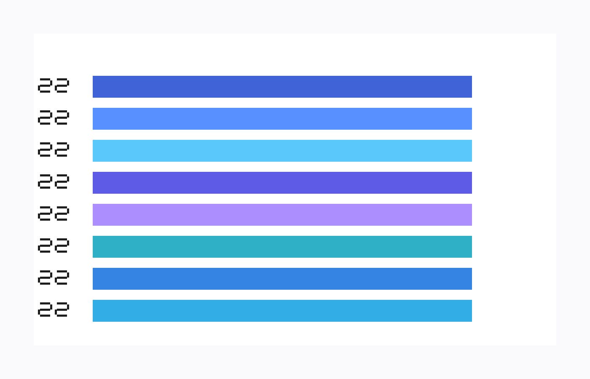
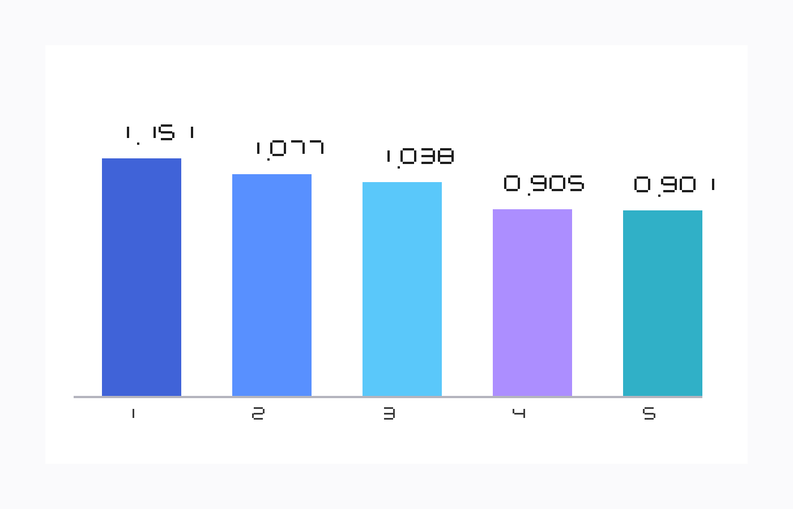

# PROJECT_STORY_NOTEBOOKLM.md

## Title

**Toward Agent-Guided Discovery of Phenothiazine Redoxmers for Redox Flow Batteries**

---

## 1. Core narrative in one paragraph

This project starts from an energy-storage problem: redox flow batteries need better organic redox-active molecules that are cheap, tunable, stable, and high-performing in solution. Phenothiazines are promising candidates, but they remain much less explored than more established redox-active families such as quinones. The central idea of this repo is that we can accelerate phenothiazine discovery by combining structured prior knowledge, transfer from better-studied molecular spaces, generative design of new candidate molecules, and an agent-guided expanding knowledge graph that continuously links molecules, measurements, literature, hypotheses, conformer searches, DFT outcomes, and simulation results. The repo implements that idea as a practical screening, generation, and validation workflow rather than a vague autonomous agent story.

---

## 2. Why this project exists

### The motivating problem

Redox flow batteries need improved molecular chemistries.

An ideal redoxmer should balance several competing requirements:
- favorable redox potential
- chemical and electrochemical stability
- solubility in the target electrolyte environment
- synthetic accessibility
- reasonable cost and tunability
- compatibility with long cycle life and practical device constraints

Many molecular families have been studied for these roles, but no single family cleanly solves the problem. That creates a strong need for targeted exploration of underdeveloped but chemically promising spaces.

### Why phenothiazines

Phenothiazines are attractive because they are:
- electronically rich and substitution-tunable
- structurally modular
- already known to participate in useful redox chemistry
- plausible candidates for high-value redoxmer design

But they are also comparatively underexplored relative to better-known redox-active scaffolds. That means there is real opportunity, but also sparse direct evidence. The project is built around that tension: there is enough signal to justify the space, but not enough mature knowledge to brute-force optimize it using only direct historical data.

---

## 3. The key scientific framing

### Phenothiazines are not the best-studied redoxmer family

A major narrative point for slides is that phenothiazines sit in an awkward but interesting position:
- they are promising enough to care about
- they are less systematically characterized than more mature redox-active families
- direct measured data is incomplete and uneven
- literature support exists, but it is fragmented

Using OpenAlex title/abstract search counts as a rough literature proxy, quinones appear in about `65,977` works, while phenothiazines appear in about `16,683`. Narrowing to redox-flow-battery context, OpenAlex returns about `366` works for quinone + redox flow battery and about `74` for phenothiazine + redox flow battery. That is not a perfect bibliometric census, but it is a very usable slide-level indicator that quinones occupy a much denser literature space overall and a larger RFB-specific literature space as well.

That makes phenothiazines a strong target for **structured inference** rather than simple lookup or naive black-box generation.

### Transfer learning from better-known molecular spaces

The project’s conceptual bet is that we should not treat phenothiazines as an isolated universe.

Instead, we want to:
- learn from better-characterized redox-active spaces such as quinones and related families
- extract transferable chemical principles
- use those principles to guide exploration in the more weakly mapped phenothiazine space
- combine direct phenothiazine evidence with analogical evidence from nearby or better-understood chemistries

This is not transfer learning in the narrow neural-network sense only. It is broader scientific transfer:
- transfer of property intuition
- transfer of substituent reasoning
- transfer of structural motifs
- transfer of measured-property relationships
- transfer of literature patterns and design rules

The knowledge graph is the mechanism that makes that transfer explicit and inspectable.

---

## 4. Project thesis

### Main thesis

**A structured, agent-guided knowledge graph can help bridge the gap between well-studied molecular spaces and relatively unexplored phenothiazine derivatives.**

The repo is designed around the idea that discovery should not be framed as:
- pure language-model ideation, or
- pure property prediction, or
- pure simulation triage

Instead, it should be framed as a loop that integrates:
- known molecules
- measured properties
- literature and patent evidence
- structure-aware retrieval
- ranking and critique
- generative proposal of new molecules
- RDKit conformer search and geometry preparation
- DFT and other simulation requests
- validation outcomes
- graph expansion into the next round of scientific questions

The result is not just a ranked list. The result is a growing, inspectable campaign memory.

---

## 5. What this repo actually is

`pz_agent` is a **modular scientific workflow** for phenothiazine screening and validation.

It is not primarily a chatbot, and it is not a vague agent demo. It is a pipeline with:
- explicit stages
- shared run state
- durable JSON artifacts
- configurable execution order
- a local provenance-rich knowledge graph

The repo currently emphasizes:
- candidate import and screening
- structure-first evidence retrieval
- identity-aware chemistry handling
- KG-backed critique and reranking
- graph expansion into follow-up actions
- simulation handoff and result reintegration
- a path toward iterative generation of new molecules based on earlier campaign outcomes

In short, it is a research orchestrator for turning sparse phenothiazine evidence into a more complete, generation-aware, simulation-informed decision process.

---

## 6. High-level workflow narrative

A clean way to present the workflow in slides is:

1. **Start with a known molecular dataset**
   - ingest phenothiazines and related records from D3TaLES or other sources

2. **Normalize chemistry and establish identity**
   - canonicalize structures
   - preserve stable identity across runs and representations

3. **Retrieve evidence**
   - structure-aware retrieval
   - literature and patent signals
   - representation-aware matching and analog support

4. **Build or expand the knowledge graph**
   - represent molecules, dataset records, measurements, evidence, predictions, and hypotheses

5. **Rank and critique candidates**
   - combine predicted priority, measured context, transferability, and evidence support

6. **Generate new molecules from prior iterations**
   - start from phenothiazines already present in D3TaLES
   - use generative AI or rule-guided proposal logic to suggest new derivatives for the next round

7. **Prepare structures for physics-based evaluation**
   - run RDKit conformer searches or geometry preparation
   - select reasonable initial structures for higher-fidelity calculations

8. **Package top generated candidates for DFT and remote simulation**
   - prepare calculation bundles and remote execution records

9. **Reintegrate validation results**
   - pull conformer/DFT/simulation outputs back into reports and the KG

10. **Repeat with a better-informed graph**
   - use newly generated molecules, validation outcomes, and updated graph structure to shape the next exploration pass

---

## 7. Why the knowledge graph matters

The knowledge graph is not ornamental. It is the main scientific memory and reasoning substrate.

It is used to connect:
- molecules
- molecular representations
- dataset records
- property measurements
- evidence hits from literature and patents
- predictions and ranking context
- simulation results
- validation outcomes
- future action proposals
- newly generated candidate molecules from later iterations

This matters because the project is trying to reason in a sparse-data regime. In that regime, it is not enough to store only candidate-level scores. We need a system that preserves:
- provenance
- identity
- measured vs inferred vs predicted distinctions
- analogical links
- contradictions and support relationships
- campaign history over time

The graph makes that explicit.

It also gives the project a natural retrieval substrate for a RAG-like workflow. Instead of asking a language model to reason from unstructured text alone, the system can retrieve structured graph-local context about molecules, measurements, scaffold neighborhoods, evidence, and prior outcomes before generating hypotheses or ranking decisions.

For NotebookLM slides, it is helpful to explain the basic idea this way:
- a **knowledge graph** stores entities and relationships, such as molecules, measured properties, papers, simulation outputs, and scaffold families
- **RAG** (retrieval-augmented generation) means retrieving the most relevant structured or textual context before asking a model to summarize, critique, prioritize, or propose next actions
- this project is a strong fit for KG + RAG because discovery decisions depend on combining many heterogeneous evidence types rather than treating each molecule as an isolated row in a spreadsheet

---

## 8. Current technical implementation

### Architecture

The system is implemented as a plain-Python multi-agent pipeline without LangGraph.

That means:
- each stage has a clear role
- state moves through the pipeline explicitly
- artifacts are written to disk in inspectable form
- runs are reproducible and debuggable

This is a deliberate choice. For scientific work, inspectability and recoverability matter more than theatrics.

### What is already in place

The repo already includes:
- D3TaLES-backed candidate ingestion
- chemistry normalization and stable molecule identity
- structure-first retrieval direction
- scholarly and patent evidence collection
- critique and reranking stages
- local provenance-rich knowledge graph construction
- graph-expansion proposals and action queueing
- simulation handoff packaging
- remote simulation submission/check/extract infrastructure
- validation ingest back into reports and the KG
- an emerging scaffold-aware and iterative workflow that can support generation, conformer search, DFT, and re-ingestion of newly proposed molecules

### Remote execution direction

The active remote execution direction is now the **HTVS-backed Supercloud path**.

That path has already been exercised through:
- job build
- Slurm submission
- ORCA completion
- HTVS reconciliation into completed-job artifacts

That is important for the project narrative because it means the repo is not only a speculative screening system. It now has a real route to physical-model validation.

---

## 9. Production KG baseline from the existing dataset

A major recent result is that the existing D3TaLES dataset can already be turned into a substantial baseline production knowledge graph.

### Current baseline KG artifact

Built from the existing `data/d3tales.csv` dataset, with zero-information rows excluded from the recommended production baseline:
- source rows in CSV: `35,777`
- filtered production molecules: `35,729`
- nodes: `617,934`
- edges: `1,710,835`

### Node structure

The filtered production graph currently contains:
- `35,729` molecule nodes
- `35,729` dataset-record nodes
- `546,459` measurement nodes
- `16` property nodes
- `1` dataset root node

### Why this matters

This means the project already has a nontrivial scientific memory substrate even **before** generating new phenothiazine molecules.

That is a strong narrative point:
- we are not starting from nothing
- we already have a large map of structured chemistry and measurements
- the immediate challenge is not “invent everything from scratch”
- the challenge is to organize, interpret, and exploit the existing knowledge more intelligently

### Coverage quality

The baseline graph has strong overall property coverage across the dataset, with many properties available for most molecules.

This supports a narrative that the project is grounded in real structured data, not only text retrieval or model guesses.

---

## 10. What the baseline KG revealed

The baseline build also exposed something scientifically useful: the graph is broadly healthy, but the data quality is not perfectly uniform.

### Observed issue: low-information tail

A small set of records had essentially no usable measurements.

In particular:
- `48` records had zero measurements
- all of them came from blank `source_group` rows
- those rows often contained only an ID and a SMILES string
- they are now excluded from the recommended production KG baseline

This is actually a positive outcome for the project, because it shows the KG is doing its job as an audit surface.

The graph is not just a downstream output. It is also revealing where the underlying dataset is thin, noisy, or poorly provenance-labeled.

### Interpretation

That supports another narrative point for the slides:

**Building the KG is not only about downstream reasoning. It is also about exposing data quality structure and making the campaign scientifically auditable.**

A small audit-and-filter pass is now part of the recommended production KG workflow.

---

## 11. What is scientifically distinctive about the repo

The most distinctive thing here is not any single model or stage. It is the combination of several ideas:

### 1. Identity-aware chemistry

The system tries to preserve stable identity for molecules and representations rather than flatten everything into transient strings.

### 2. Evidence-aware decision making

It combines:
- measured properties
- literature support
- analogical evidence
- structural retrieval
- prediction outputs
- critique and ranking rationale

### 3. Supervised self-expansion

Rather than free-form autonomous wandering, the system turns uncertainty and frontier conditions into structured next actions.

### 4. Real validation loop

The project is no longer only generating hypotheses. It can hand candidates off to remote simulation and reintegrate results.

### 5. Transfer-oriented framing

It is designed to learn not only from direct phenothiazine evidence, but also from better-understood neighboring chemical spaces.

### 6. Iterative generation tied to campaign memory

The long-term direction is not one-shot molecule generation. It is iterative generation in which new candidates are proposed from prior phenothiazine rounds, evaluated with conformer search and DFT, and then written back into the graph so the next generation step starts from a richer scientific context.

---

## 12. What is not finished yet

This should also be explicit in the story.

### The project is not yet a closed-loop generator of novel validated phenothiazines

It is better described as a **strong screening-and-validation foundation with a clear path toward iterative generation**.

The biggest unfinished pieces are:
- deeper chemistry-native generation
- stronger transfer-learning machinery across molecular families
- more rigorous calibration of ranking and scoring
- fuller use of validation outcomes to reshape future candidate design
- stricter downstream contracts for result consumption and acceptance gates
- tighter integration of generated-molecule loops with conformer search, DFT, and KG updates

That is okay. For a slide deck, this creates a strong “current status + next frontier” story.

---

## 13. Recommended slide-by-slide narrative

### Slide 1. Why do we need new redox flow battery chemistries?
- motivate flow batteries
- motivate the importance of molecular redox couples
- highlight the need for tunable, stable, soluble, affordable organic redoxmers

### Slide 2. Why phenothiazines?
- introduce phenothiazines as promising but comparatively underexplored redoxmers
- emphasize tunability and opportunity
- frame the sparsity of direct knowledge as both challenge and opportunity

### Slide 3. Phenothiazines are relatively underexplored compared with better-known redox-active spaces
- compare against quinones and other better-mapped families
- include explicit OpenAlex counts: about `65,977` quinone works vs about `16,683` phenothiazine works
- in redox-flow-battery context, include about `366` quinone + RFB works vs about `74` phenothiazine + RFB works
- emphasize uneven evidence density and the need for transfer rather than brute-force local optimization

### Slide 4. Scientific hypothesis: transfer from mature molecular spaces to sparse ones
- use quinones or other well-studied redoxmers as the motivating example
- describe transfer of chemical principles, property intuition, and structural heuristics
- frame the problem as knowledge transfer under uncertainty

### Slide 5. Knowledge graphs and RAG, in plain language
- explain that a knowledge graph stores entities and relationships rather than only flat rows
- explain that RAG retrieves relevant context before generation, ranking, or explanation
- emphasize that this is useful here because molecular discovery depends on linking structures, measurements, literature, simulations, and hypotheses

### Slide 6. Why an expanding knowledge graph?
- show that discovery needs more than a ranked table
- motivate persistent scientific memory linking molecules, measurements, evidence, hypotheses, generated candidates, and validation results
- distinguish measured vs inferred vs predicted information

### Slide 7. Our implementation: agent-guided expanding knowledge graphs
- show pipeline stages at high level
- candidate import → normalization → retrieval → KG → ranking/critique → generation of new molecules → conformer search → DFT/simulation → validation → KG update

### Slide 8. The repo today
- summarize what is already implemented
- emphasize that this is a working scientific workflow, not only a concept
- mention real HTVS-backed remote simulation integration

### Slide 9. Baseline production KG from existing data
- show the D3TaLES-derived KG statistics
- emphasize that the project already has a substantial structured substrate before novel generation

### Slide 10. What the KG already tells us
- highlight property coverage and graph richness
- show that the KG also exposes low-information or poor-provenance records
- present the graph as both reasoning engine and audit tool

### Slide 11. Where this goes next
- use the KG as the substrate for better phenothiazine prioritization
- generate new molecules beginning from phenothiazines already found in D3TaLES
- evaluate those generated molecules with RDKit conformer search and DFT
- feed the new molecules and results back into the KG for the next iteration

### Slide 12. Long-term vision
- a scientifically grounded, continuously learning discovery loop for underexplored redoxmer spaces
- agents as orchestrators of structured reasoning, not magic black boxes
- generation, simulation, and validation all close the loop through the evolving graph

---

## 14. Suggested framing language for NotebookLM narration

Useful phrases for narration:
- “This project is motivated by the need for better organic redox-active molecules for flow batteries.”
- “Phenothiazines are promising, but they remain much less systematically mapped than more mature redox-active families such as quinones.”
- “Using OpenAlex title-and-abstract counts as a rough proxy, quinones show about 65,977 papers overall versus about 16,683 for phenothiazines, and about 366 quinone redox-flow-battery papers versus about 74 for phenothiazines.”
- “The central challenge is how to reason effectively in a sparse-data molecular space.”
- “Our answer is to use an agent-guided expanding knowledge graph that connects molecules, measurements, evidence, hypotheses, generated candidates, and validation outcomes.”
- “The graph is not just a database, it is the scientific memory of the campaign.”
- “Rather than asking a language model to invent chemistry from scratch, we use structured retrieval, provenance, critique, generation, and simulation feedback to guide exploration.”
- “A key theme is transfer: learning from better-understood molecular families to navigate relatively unexplored phenothiazine chemical space.”
- “The current system already supports a real screening-to-simulation-to-validation workflow.”
- “The next step is to make that loop more iterative by generating new molecules, evaluating them computationally, and writing the outcomes back into the graph.”

---

## 15. Bottom line

The story of this repo is:

1. redox flow batteries need better molecular chemistries
2. phenothiazines are promising but underexplored
3. sparse evidence makes naive discovery inefficient
4. transfer from better-known spaces can help
5. an agent-guided expanding knowledge graph is the mechanism for organizing that transfer and uncertainty
6. the repo already implements much of this workflow in practice
7. the existing dataset is already large enough to support a substantial production baseline KG
8. the next milestone is to use that graph more aggressively as the foundation for prioritization, generation of new molecules, conformer search, DFT validation, and iterative campaign memory
